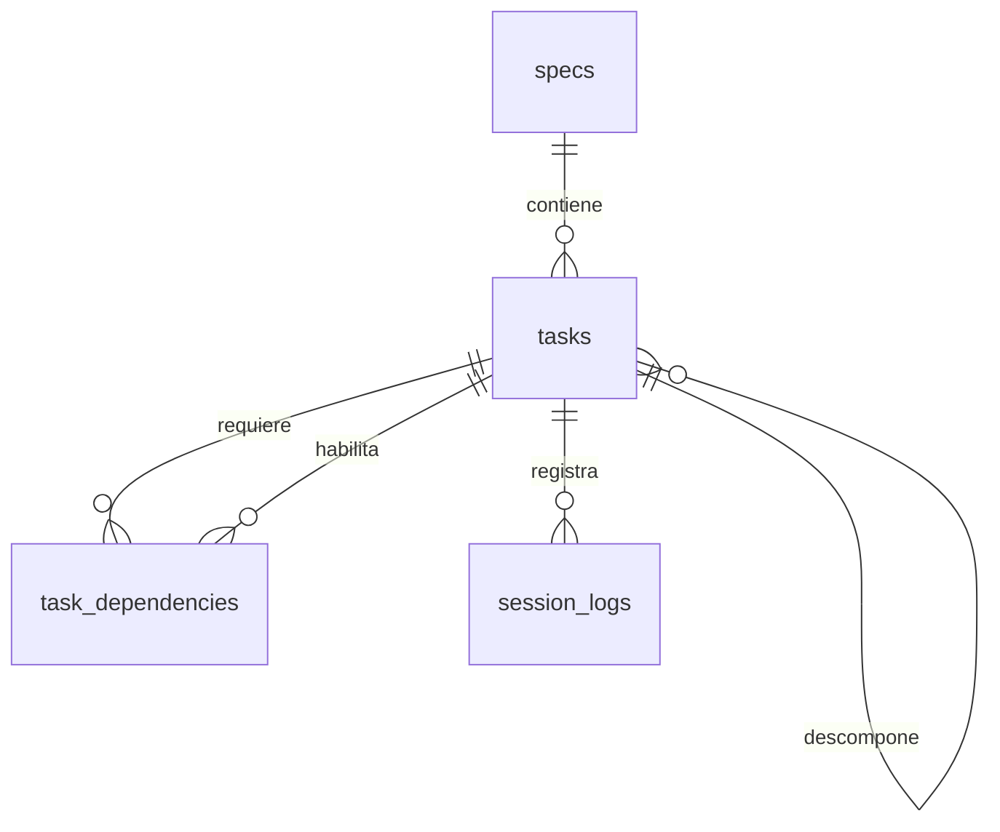

# Esquema de seguimiento de implementación

La base representa el trabajo de una feature como una cadena trazable: una especificación define la intención, las tareas convierten esa intención en actividades ordenadas y las sesiones documentan cómo se ejecutó cada actividad. El modelo sirve igual para personas y agentes: la identidad de quien trabajó no condiciona el estado ni el historial.

## Conceptos del modelo

| Concepto | Representación | Significado |
| --- | --- | --- |
| Especificación | `specs` | El contrato funcional de una feature. Su `slug` es único y estable para identificarla. |
| Plan de trabajo | `tasks` | Actividades que materializan una spec; pueden organizarse como árbol mediante `parent_id`. |
| Orden de ejecución | `task_dependencies` | Relación de prerrequisito: `required_task_id` debe estar terminada antes de avanzar `task_id`. |
| Evidencia de trabajo | `session_logs` | Cierre de una sesión sobre una tarea: resumen, decisiones y archivos afectados. |

## Especificaciones y tareas

Una fila de `specs` contiene el título, el `slug` y una descripción Markdown. Semánticamente, esa descripción debe exponer el objetivo, impacto, alcance incluido y excluido, criterios de aceptación, RBAC, ADRs y archivos relevantes. La base conserva el Markdown como fuente de contexto; no intenta interpretar su sintaxis.

Cada `tasks` pertenece obligatoriamente a una spec. Su descripción Markdown reutiliza el mismo contrato, pero limitado a la responsabilidad de la actividad. `branch` es opcional y representa la rama asignada para implementarla. Las marcas `created_at` y `updated_at` permiten distinguir la creación de un cambio posterior en el plan.

Una tarea puede tener una tarea padre para formar subtareas. Padre e hija siempre pertenecen a la misma spec y la jerarquía no admite ciclos. Una tarea no puede trasladarse a otra spec después de crearse: así se evita que se rompa el contexto semántico de su árbol, dependencias y bitácora.

## Estado y dependencias

El estado de una tarea es uno de los siguientes:

| Estado | Lectura operativa |
| --- | --- |
| `blocked` | No debe continuar hasta resolver un impedimento externo o de definición. |
| `pending` | Está planificada, pero aún no se inicia. |
| `wip` | Se encuentra en implementación. |
| `in_review` | La implementación está lista para revisión o validación. |
| `done` | La actividad se considera terminada. |

`task_dependencies` expresa que una tarea necesita una base ya terminada. Las dos tareas deben pertenecer a la misma spec, una tarea no puede depender de sí misma y el grafo de dependencias debe permanecer sin ciclos.

La regla de avance se materializa en la base: si una tarea tiene algún prerrequisito que no esté en `done`, no puede cambiar a `wip`, `in_review` ni `done`. Tampoco se puede añadir un prerrequisito inacabado a una tarea que ya está en cualquiera de esos estados. Esto convierte las dependencias en una señal operativa fiable para retomar el trabajo entre sesiones.

## Bitácora de sesiones

Cada `session_logs` se asocia a una tarea y a un `session_id`; la combinación es única para evitar registrar dos cierres para la misma tarea y sesión. El log registra:

- `overview`: resumen Markdown del trabajo realizado.
- `taken_decisions`: arreglo JSON de decisiones de negocio tomadas ante huecos de la spec. Cada elemento requiere `decision`, `gap` y `justify` como texto.
- `files_changed`: arreglo JSON de cambios en el repositorio. Cada elemento requiere `type` (`creation`, `modification` o `deletion`), `file` y `reason`.
- `created_at`: momento en que se cerró el registro.

Los arreglos pueden estar vacíos cuando no hubo decisiones o archivos que reportar, pero si contienen elementos estos deben respetar el contrato anterior. Esto permite consultar el contexto de una actividad sin depender de memoria de sesión o del historial de chat.

## Operación resumida

1. Se crea una spec con su descripción de alcance y aceptación.
2. Se descompone en tareas y subtareas; se registran los prerrequisitos en `task_dependencies`.
3. Se identifica una tarea `pending` cuyas dependencias estén en `done` y se cambia a `wip`.
4. Al terminar una sesión, se agrega un `session_logs` con lo hecho, decisiones de negocio y archivos tocados.
5. La tarea avanza a `in_review` o `done` cuando corresponda; la siguiente tarea habilitada se convierte en el punto de continuación.

Las claves foráneas de SQLite deben activarse en cada conexión de escritura con `PRAGMA foreign_keys = ON;`. El comando de scaffold crea una base nueva de forma atómica y no reemplaza una existente salvo que se indique `--force`.
