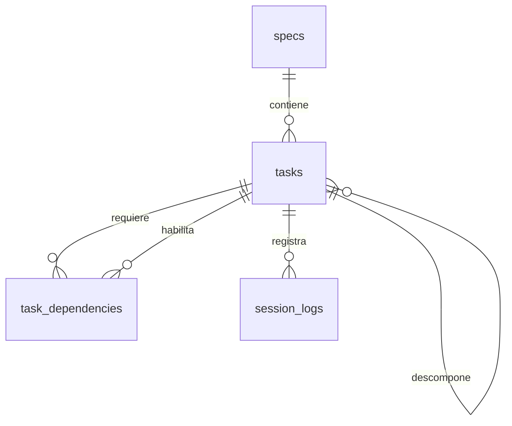

# Esquema de seguimiento de implementación

La base representa el trabajo de una feature como una cadena trazable: una especificación define la intención, las tareas convierten esa intención en actividades ordenadas y las sesiones documentan cómo se ejecutó cada actividad. El modelo sirve igual para personas y agentes: la identidad de quien trabajó no condiciona el estado ni el historial.

## Conceptos del modelo

| Concepto | Representación | Significado |
| --- | --- | --- |
| Especificación | `specs` | El contrato funcional de una feature. Su `slug` es único y estable para identificarla. |
| Plan de trabajo | `tasks` | Actividades que materializan una spec; pueden organizarse como árbol mediante `parent_id`. |
| Orden de ejecución | `task_dependencies` | Relación de prerrequisito: `required_task_id` debe estar terminada antes de avanzar `task_id`. |
| Evidencia de trabajo | `session_logs` | Cierre de una sesión sobre una tarea: resumen, decisiones y archivos afectados. |

## Referencia física de las tablas

SQLite conserva los valores según afinidad de tipo. En este esquema, los identificadores y relaciones usan `INTEGER`; el contenido Markdown, JSON y las marcas de tiempo usan `TEXT`. `INTEGER PRIMARY KEY` es el alias del `rowid` de SQLite: si no se proporciona, SQLite asigna el identificador automáticamente.

### `specs`

Una especificación es el agregado raíz del modelo. El borrado de una spec elimina en cascada sus tareas y, por extensión, las dependencias y bitácoras de esas tareas.

| Columna | Tipo | Nulo / valor por defecto | Claves y restricciones |
| --- | --- | --- | --- |
| `id` | `INTEGER` | No | Clave primaria. |
| `title` | `TEXT` | No | No puede quedar vacío tras aplicar `trim`. |
| `slug` | `TEXT` | No | Único. Solo minúsculas, dígitos y guiones; no admite guiones iniciales, finales ni consecutivos. |
| `description` | `TEXT` | No | Markdown no vacío tras `trim`. |
| `created_at` | `TEXT` | No; `CURRENT_TIMESTAMP` | Fecha/hora de creación en formato SQLite UTC. |
| `updated_at` | `TEXT` | No; `CURRENT_TIMESTAMP` | Se actualiza automáticamente al cambiar `title`, `slug` o `description`. |

### `tasks`

Una tarea pertenece a una única spec y puede ser raíz o subtarea. La columna `parent_id` forma una relación recursiva dentro de la misma tabla.

| Columna | Tipo | Nulo / valor por defecto | Claves y restricciones |
| --- | --- | --- | --- |
| `id` | `INTEGER` | No | Clave primaria. |
| `spec_id` | `INTEGER` | No | Clave foránea a `specs.id`; `ON DELETE CASCADE`. No puede modificarse después de crear la tarea. |
| `title` | `TEXT` | No | No vacío tras `trim`. |
| `description` | `TEXT` | No | Markdown no vacío tras `trim`. |
| `status` | `TEXT` | No; `pending` | Solo `blocked`, `pending`, `wip`, `in_review` o `done`. |
| `parent_id` | `INTEGER` | Sí; `NULL` | Clave foránea a `tasks.id`; `ON DELETE CASCADE`. Debe apuntar a una tarea de la misma spec. |
| `branch` | `TEXT` | Sí; `NULL` | Si se proporciona, no puede ser una cadena vacía o solo espacios. |
| `created_at` | `TEXT` | No; `CURRENT_TIMESTAMP` | Fecha/hora de creación. |
| `updated_at` | `TEXT` | No; `CURRENT_TIMESTAMP` | Se actualiza automáticamente cuando cambia título, descripción, estado, padre o rama. |

Eliminar una tarea elimina sus subtareas, sus dependencias y sus registros de sesión por las reglas de cascada. No existe una relación de tareas entre specs: el trigger rechaza tanto un padre de otra spec como el traslado posterior de `spec_id`.

### `task_dependencies`

Esta tabla no tiene un identificador artificial: la pareja de columnas define la relación y constituye su clave primaria. La fila se lee como: **`task_id` requiere que `required_task_id` esté terminada**.

| Columna | Tipo | Nulo / valor por defecto | Claves y restricciones |
| --- | --- | --- | --- |
| `task_id` | `INTEGER` | No | Parte 1 de la clave primaria compuesta; clave foránea a `tasks.id`, `ON DELETE CASCADE`. |
| `required_task_id` | `INTEGER` | No | Parte 2 de la clave primaria compuesta; clave foránea a `tasks.id`, `ON DELETE CASCADE`. |

Además de las claves foráneas, un `CHECK` impide que ambas columnas sean iguales. La clave primaria compuesta rechaza duplicados; los triggers impiden dependencias entre specs y ciclos directos o transitivos en el grafo.

### `session_logs`

La bitácora registra el cierre de una sesión sobre una tarea. Una misma sesión puede registrar trabajo en tareas distintas, pero no puede tener dos filas para la misma tarea.

| Columna | Tipo | Nulo / valor por defecto | Claves y restricciones |
| --- | --- | --- | --- |
| `id` | `INTEGER` | No | Clave primaria. |
| `task_id` | `INTEGER` | No | Clave foránea a `tasks.id`; `ON DELETE CASCADE`. |
| `session_id` | `TEXT` | No | No vacío tras `trim`; único en combinación con `task_id`. |
| `overview` | `TEXT` | No | Resumen Markdown no vacío tras `trim`. |
| `taken_decisions` | `TEXT` | No; `[]` | JSON válido cuyo valor raíz es un arreglo. |
| `files_changed` | `TEXT` | No; `[]` | JSON válido cuyo valor raíz es un arreglo. |
| `created_at` | `TEXT` | No; `CURRENT_TIMESTAMP` | Momento de cierre del registro. |

La restricción única es `UNIQUE (task_id, session_id)`. Al borrar una tarea, sus logs se eliminan en cascada.

### Contrato de columnas JSON

Los `CHECK` garantizan que ambas columnas sean arreglos JSON y los triggers validan cada elemento al insertar o modificar la fila.

| Columna | Forma de cada elemento | Reglas adicionales |
| --- | --- | --- |
| `taken_decisions` | `{ "decision": string, "gap": string, "justify": string }` | Los tres textos son obligatorios y no vacíos tras `trim`. |
| `files_changed` | `{ "type": string, "file": string, "reason": string }` | `type` solo admite `creation`, `modification` o `deletion` (sin distinguir mayúsculas); `file` y `reason` no pueden estar vacíos. |

Los arreglos vacíos son válidos. El esquema permite propiedades JSON adicionales, pues no alteran el contrato mínimo exigido.

## Índices

| Índice | Columnas | Uso previsto |
| --- | --- | --- |
| `tasks_by_spec_and_status` | `tasks(spec_id, status)` | Listar el trabajo de una spec por estado. |
| `tasks_by_parent` | `tasks(parent_id)` | Recuperar subtareas de una actividad. |
| `task_dependencies_by_required_task` | `task_dependencies(required_task_id)` | Encontrar tareas que quedan afectadas por un prerrequisito. |
| `session_logs_by_task_and_created_at` | `session_logs(task_id, created_at)` | Consultar la bitácora cronológica de una tarea. |

Los `UNIQUE` de `specs.slug`, `session_logs(task_id, session_id)` y la clave primaria compuesta de `task_dependencies` también generan índices únicos internos.

## Reglas aplicadas por triggers

| Área | Regla |
| --- | --- |
| Marcas de tiempo | Al actualizar los campos editables de `specs` o `tasks`, se refresca `updated_at`. |
| Árbol de tareas | Un padre debe estar en la misma spec; no puede ser la propia tarea ni producir un ciclo. |
| Pertenencia | `tasks.spec_id` es inmutable después de crear la tarea. |
| Grafo de dependencias | Ambas tareas deben estar en la misma spec y el nuevo enlace no puede crear un ciclo. |
| Avance de estado | Una tarea con dependencias no terminadas no puede pasar a `wip`, `in_review` ni `done`. |
| Dependencias tardías | No puede añadirse una dependencia sin terminar a una tarea que ya está en `wip`, `in_review` o `done`. |
| Bitácora | Los elementos de los dos arreglos JSON deben respetar su contrato mínimo. |

## Especificaciones y tareas

Una fila de `specs` contiene el título, el `slug` y una descripción Markdown. Semánticamente, esa descripción debe exponer el objetivo, impacto, alcance incluido y excluido, criterios de aceptación, RBAC, ADRs y archivos relevantes. La base conserva el Markdown como fuente de contexto; no intenta interpretar su sintaxis.

Cada `tasks` pertenece obligatoriamente a una spec. Su descripción Markdown reutiliza el mismo contrato, pero limitado a la responsabilidad de la actividad. `branch` es opcional y representa la rama asignada para implementarla. Las marcas `created_at` y `updated_at` permiten distinguir la creación de un cambio posterior en el plan.

Una tarea puede tener una tarea padre para formar subtareas. Padre e hija siempre pertenecen a la misma spec y la jerarquía no admite ciclos. Una tarea no puede trasladarse a otra spec después de crearse: así se evita que se rompa el contexto semántico de su árbol, dependencias y bitácora.

## Estado y dependencias

El estado de una tarea es uno de los siguientes:

| Estado | Lectura operativa |
| --- | --- |
| `blocked` | No debe continuar hasta resolver un impedimento externo o de definición. |
| `pending` | Está planificada, pero aún no se inicia. |
| `wip` | Se encuentra en implementación. |
| `in_review` | La implementación está lista para revisión o validación. |
| `done` | La actividad se considera terminada. |

`task_dependencies` expresa que una tarea necesita una base ya terminada. Las dos tareas deben pertenecer a la misma spec, una tarea no puede depender de sí misma y el grafo de dependencias debe permanecer sin ciclos.

La regla de avance se materializa en la base: si una tarea tiene algún prerrequisito que no esté en `done`, no puede cambiar a `wip`, `in_review` ni `done`. Tampoco se puede añadir un prerrequisito inacabado a una tarea que ya está en cualquiera de esos estados. Esto convierte las dependencias en una señal operativa fiable para retomar el trabajo entre sesiones.

## Bitácora de sesiones

Cada `session_logs` se asocia a una tarea y a un `session_id`; la combinación es única para evitar registrar dos cierres para la misma tarea y sesión. El log registra:

- `overview`: resumen Markdown del trabajo realizado.
- `taken_decisions`: arreglo JSON de decisiones de negocio tomadas ante huecos de la spec. Cada elemento requiere `decision`, `gap` y `justify` como texto.
- `files_changed`: arreglo JSON de cambios en el repositorio. Cada elemento requiere `type` (`creation`, `modification` o `deletion`), `file` y `reason`.
- `created_at`: momento en que se cerró el registro.

Los arreglos pueden estar vacíos cuando no hubo decisiones o archivos que reportar, pero si contienen elementos estos deben respetar el contrato anterior. Esto permite consultar el contexto de una actividad sin depender de memoria de sesión o del historial de chat.

## Operación resumida

1. Se crea una spec con su descripción de alcance y aceptación.
2. Se descompone en tareas y subtareas; se registran los prerrequisitos en `task_dependencies`.
3. Se identifica una tarea `pending` cuyas dependencias estén en `done` y se cambia a `wip`.
4. Al terminar una sesión, se agrega un `session_logs` con lo hecho, decisiones de negocio y archivos tocados.
5. La tarea avanza a `in_review` o `done` cuando corresponda; la siguiente tarea habilitada se convierte en el punto de continuación.

Las claves foráneas de SQLite deben activarse en cada conexión de escritura con `PRAGMA foreign_keys = ON;`. El comando de scaffold crea una base nueva de forma atómica y no reemplaza una existente salvo que se indique `--force`.
