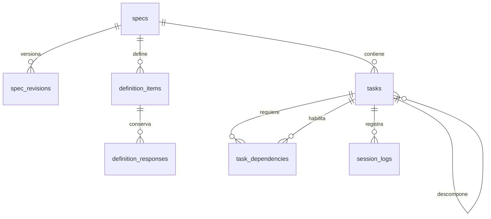
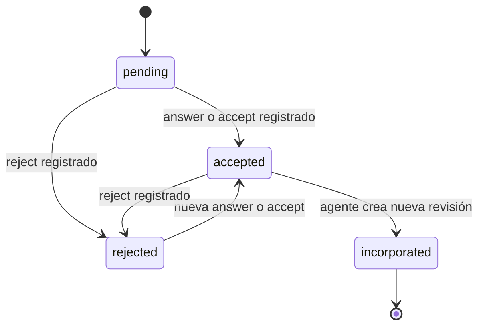

# Esquema del workflow de definición e implementación

La base SQLite separa la definición funcional de una feature de su ejecución. Una `spec` conserva su identidad estable; sus revisiones son snapshots Markdown completos e inmutables. Los asuntos que todavía requieren una decisión humana se almacenan aparte, junto con todas sus respuestas. Las tareas y las bitácoras continúan describiendo la implementación.

El dashboard registra interacciones en las tablas de definición, pero nunca modifica el Markdown ni crea revisiones. Un agente de generación de specs es quien incorpora una decisión aceptada creando una revisión nueva y marcando el asunto como incorporado.

## Modelo conceptual

| Concepto | Representación | Significado |
| --- | --- | --- |
| Identidad de feature | `specs` | Título, slug estable, request actual y revisión vigente. |
| Snapshot de definición | `spec_revisions` | Markdown completo de una versión de la spec. |
| Asunto por resolver | `definition_items` | Aclaración, tensión, impacto o ejemplo que necesita interacción humana. |
| Historial de interacción | `definition_responses` | Respuestas, aceptaciones, rechazos u observaciones sobre un asunto. |
| Plan de trabajo | `tasks` | Actividades de implementación, organizables en árbol. |
| Orden de ejecución | `task_dependencies` | Prerrequisitos entre tareas de la misma spec. |
| Evidencia de trabajo | `session_logs` | Resumen, decisiones y archivos afectados en una sesión. |

## Definición versionada

### `specs`

Una fila identifica la feature durante toda su evolución. `description` conserva el request o descripción actual; la definición renderizable está en la revisión apuntada por `current_revision_id`.

| Columna | Tipo | Nulo / valor por defecto | Claves y restricciones |
| --- | --- | --- | --- |
| `id` | `INTEGER` | No | Clave primaria. |
| `title` | `TEXT` | No | No vacío tras `trim`. |
| `slug` | `TEXT` | No | Único; minúsculas, dígitos y guiones no consecutivos, sin guion inicial o final. |
| `description` | `TEXT` | No | Request Markdown no vacío. Cambiarlo no elimina revisiones. |
| `current_revision_id` | `INTEGER` | Sí hasta crear la primera revisión | Clave foránea a `spec_revisions.id`; siempre debe ser la última revisión de la misma spec. |
| `created_at` | `TEXT` | No; `CURRENT_TIMESTAMP` | Fecha/hora UTC de creación. |
| `updated_at` | `TEXT` | No; `CURRENT_TIMESTAMP` | Se actualiza al cambiar datos editables o la revisión vigente. |

### `spec_revisions`

Cada revisión contiene la spec Markdown completa y autosuficiente de ese momento. No es un diff: para entender la revisión actual no se consultan las anteriores.

| Columna | Tipo | Nulo / valor por defecto | Claves y restricciones |
| --- | --- | --- | --- |
| `id` | `INTEGER` | No | Clave primaria. |
| `spec_id` | `INTEGER` | No | Clave foránea a `specs.id`; `ON DELETE CASCADE`. |
| `revision_number` | `INTEGER` | No | Positivo, único y estrictamente secuencial dentro de su spec, empezando en 1. |
| `content` | `TEXT` | No | Markdown completo no vacío. Es inmutable. |
| `created_at` | `TEXT` | No; `CURRENT_TIMESTAMP` | Momento de creación del snapshot. |

Al insertar una revisión, el trigger la convierte automáticamente en `specs.current_revision_id`. No se permite apuntar a una revisión de otra spec, a una revisión anterior ni vaciar la referencia cuando ya existen revisiones. Cualquier `UPDATE` de una revisión se rechaza para preservar el historial.

## Asuntos de definición e interacciones

### `definition_items`

Un item reemplaza el WIP documental: representa un asunto concreto que el dashboard puede presentar a una persona. No contiene ni edita el Markdown de la spec.

| Columna | Tipo | Nulo / valor por defecto | Claves y restricciones |
| --- | --- | --- | --- |
| `id` | `INTEGER` | No | Clave primaria. |
| `spec_id` | `INTEGER` | No | Clave foránea a `specs.id`; `ON DELETE CASCADE`. |
| `type` | `TEXT` | No | `clarification`, `tension`, `impact` o `example`. |
| `source` | `TEXT` | No | `description`, `spec` o `base_branch`. |
| `title` | `TEXT` | No | Título no vacío. |
| `description` | `TEXT` | No | Contexto no vacío del asunto. |
| `question` | `TEXT` | Sí | Pregunta a responder; obligatoria para `clarification`. |
| `suggested_resolution` | `TEXT` | Sí | Resolución o criterio propuesto por el agente. |
| `example_type` | `TEXT` | Sí | Obligatorio solo para `example`: `happy-path` o `edge-case`. |
| `fingerprint` | `TEXT` | No | Identificador estable no vacío para deduplicar asuntos abiertos equivalentes. |
| `status` | `TEXT` | No; `pending` | `pending`, `accepted`, `rejected` o `incorporated`. |
| `accepted_revision_number` | `INTEGER` | No; `0` | Número de revisión vigente al aceptar el item; la base lo registra automáticamente. |
| `incorporated_in_revision_id` | `INTEGER` | Sí hasta incorporar | Revisión vigente de la misma spec que incorporó la decisión; obligatoria solo en `incorporated`. |
| `created_at` / `updated_at` | `TEXT` | No; `CURRENT_TIMESTAMP` | Creación y última actualización operativa. |

Las aclaraciones requieren una `question` no nula y no vacía. El índice único parcial `(spec_id, fingerprint)` aplica únicamente cuando el estado es `pending` o `accepted`. Así, el análisis repetido no puede crear el mismo asunto activo de forma indefinida, pero sí puede registrar una nueva aparición tras un rechazo o una incorporación histórica.

### `definition_responses`

Esta tabla conserva el historial append-only de intervención humana de un item.

| Columna | Tipo | Nulo / valor por defecto | Claves y restricciones |
| --- | --- | --- | --- |
| `id` | `INTEGER` | No | Clave primaria. |
| `definition_item_id` | `INTEGER` | No | Clave foránea a `definition_items.id`; `ON DELETE CASCADE`. |
| `response_type` | `TEXT` | No | `answer`, `accept`, `reject` u `observation`. |
| `content` | `TEXT` | No; cadena vacía | Obligatorio y no vacío para `answer` y `observation`; opcional para el checkbox de `accept` o `reject`. |
| `created_at` | `TEXT` | No; `CURRENT_TIMESTAMP` | Momento de la interacción. |

No se sustituyen respuestas anteriores. Una vez que un item está `incorporated`, no se admiten más respuestas: su interacción queda cerrada como parte del historial.

### Estados de definición

Los items comienzan obligatoriamente en `pending`. La base permite estas transiciones:

Una transición a `accepted` exige al menos una respuesta `answer` o `accept`; una transición a `rejected` exige una respuesta `reject`. Al aceptar, la base registra automáticamente el número de revisión vigente. La transición `accepted → incorporated` exige `incorporated_in_revision_id`, y el trigger verifica que sea la revisión vigente de la misma spec y que su número sea posterior al registrado al aceptar. Por ello el agente debe crear una revisión Markdown nueva antes de incorporar el item. `incorporated` no puede volver a un estado operativo.

El estado de una spec se deriva, no se almacena: `defined` equivale a no tener items `pending`; de lo contrario es `draft`. La vista `spec_definition_states` expone ese resultado por `spec_id`, y `scripts.scaffold_db.is_spec_defined(connection, spec_id)` lo consulta para que CLI, dashboard y agentes no repliquen la condición. Añadir un item pendiente devuelve automáticamente una spec a `draft`.

## Implementación

### `tasks`

Una tarea pertenece a una única spec y puede ser raíz o subtarea. `parent_id` forma una relación recursiva dentro de la misma spec.

| Columna | Tipo | Nulo / valor por defecto | Claves y restricciones |
| --- | --- | --- | --- |
| `id` | `INTEGER` | No | Clave primaria. |
| `spec_id` | `INTEGER` | No | Clave foránea a `specs.id`; `ON DELETE CASCADE`. Inmutable tras crearla. |
| `title` / `description` | `TEXT` | No | Textos Markdown no vacíos. |
| `status` | `TEXT` | No; `pending` | `blocked`, `pending`, `wip`, `in_review` o `done`. |
| `parent_id` | `INTEGER` | Sí | Clave foránea a `tasks.id`; `ON DELETE CASCADE`; debe pertenecer a la misma spec. |
| `branch` | `TEXT` | Sí | Si existe, no puede ser vacío. |
| `created_at` / `updated_at` | `TEXT` | No; `CURRENT_TIMESTAMP` | Creación y última modificación. |

### `task_dependencies`

La fila significa que `task_id` requiere que `required_task_id` esté terminada. La clave primaria compuesta evita duplicados y un `CHECK` evita una dependencia de sí misma. Ambos extremos deben pertenecer a la misma spec y el grafo no admite ciclos.

### `session_logs`

Una bitácora pertenece a una tarea y una pareja `(task_id, session_id)` es única. `overview` es Markdown no vacío. `taken_decisions` y `files_changed` son arreglos JSON válidos; sus elementos deben respetar, respectivamente, `{ decision, gap, justify }` y `{ type, file, reason }`, donde `type` es `creation`, `modification` o `deletion`.

## Índices y triggers relevantes

| Recurso | Propósito |
| --- | --- |
| `spec_revisions_by_spec_and_created_at` | Historial cronológico de revisiones. |
| `definition_items_by_spec_and_status` | Listar pendientes y filtros por estado. |
| `definition_items_by_spec_and_type` | Filtros de aclaraciones, tensiones, impactos y ejemplos. |
| `definition_responses_by_item_and_created_at` | Mostrar el historial de un asunto en orden. |
| `tasks_by_spec_and_status`, `tasks_by_parent` | Progreso y árbol de implementación. |
| `task_dependencies_by_required_task` | Tareas afectadas por un prerrequisito. |
| `session_logs_by_task_and_created_at` | Bitácora cronológica de una tarea. |

Además de las reglas de definición, los triggers existentes mantienen la integridad del árbol de tareas, el grafo de dependencias, el avance bloqueado por prerrequisitos y el contrato de los arreglos JSON de las bitácoras.

## Operación resumida

1. Se crea una spec con su `description` y, cuando existe una definición, su revisión Markdown inicial.
2. El agente registra items con `fingerprint` para los asuntos que requieren intervención humana.
3. El dashboard crea respuestas y cambia los items a `accepted` o `rejected`; nunca toca `spec_revisions`.
4. El agente lee los items aceptados, crea una nueva revisión Markdown completa y los marca `incorporated`.
5. Las tareas, dependencias y bitácoras guían la implementación de la spec ya definida.

Las claves foráneas de SQLite deben activarse en cada conexión de escritura con `PRAGMA foreign_keys = ON;`. El comando de scaffold crea una base nueva de forma atómica y no reemplaza una existente salvo que se indique `--force`; las bases existentes no se migran automáticamente.
